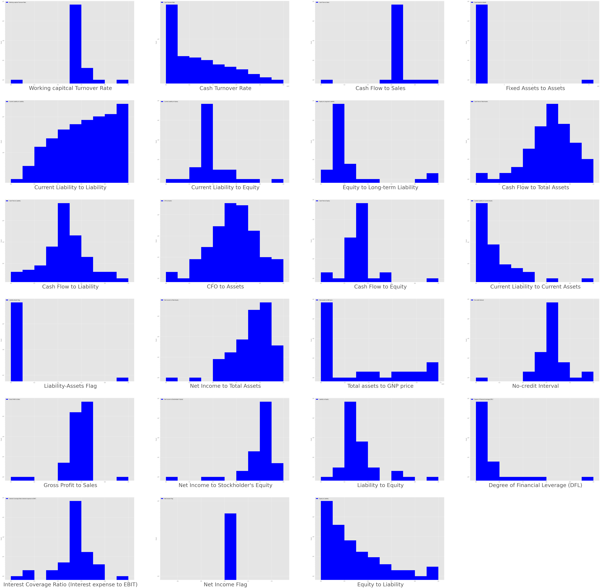

```{r, message=FALSE, echo=FALSE, warning=FALSE}
library(knitr)
library(readr)
library(ggplot2)
library(tidyverse)
library(scales)
library(kableExtra)
library(modelsummary)
library(psych)
library(corrplot)
library(caret)
library(dplyr)
library(reticulate)
```

```{python, echo=FALSE}
import pandas as pd
import numpy as np
import matplotlib.pyplot as plt
import seaborn as sns
import statsmodels
from statsmodels.stats.outliers_influence import variance_inflation_factor
```


# Introduction
<div style="text-align: justify"> 

En 2021 à Taiwan, le nombre d’entreprises déclarées en faillite est en moyenne de 2400 par mois. La faillite des entreprises présente des enjeux d’envergure particulièrement durant la crise de la Covid-19, où de nombreuses entreprises à travers le monde se sont retrouvées en difficultés dans l’exercice de leurs activités. Nous observons aussi une hausse des prêts garantis par les États dans certains pays, afin de contenir les effets de la crise sur le financement des entreprises. Ainsi il serait crucial de trouver la méthodologie adéquate afin de pouvoir prédire les faillites d’entreprises dans l’optique de pouvoir estimer les besoins de chacune en matière d’aides et de financement.

Plusieurs travaux montrent que la faillite d’une entreprise est le fruit de difficultés financières mesurables par un large panel d’indicateurs. Ainsi, notre étude consistera à déterminer plusieurs modèles prédictifs sur la base d’indicateurs financiers de l’entreprise. Nous évaluerons par la suite la précision prédictive de chacun des modèles et nous comparerons les performances des meilleures spécifications. 


Les données que nous utiliserons proviennent du **Taiwan Economic Journal**. Elles couvrent la période 1999-2009 et concernent des entreprises taïwanaises. La base de données compte alors 6819 observations ainsi que 95 variables, l’unité d’observation étant les entreprises.

L’étude de la prédiction des faillites d’entreprises a déjà été traité plusieurs fois. Les articles traitant de ce sujet, utilisent de multiples méthodes d’apprentissage automatique. Notre projet se basera sur la comparaison de plusieurs modèles de *classification* en tentant d’y ajouter des approches qui n’ont pas été traitées jusqu’à maintenant. Nous nous inspirerons également des modèles déjà effectués tout en essayant de les approfondir. De plus, nous tenterons d’aborder le choix des variables et leur traitement de manière différente. 

Notre étude s'articulera en cinq parties : 

- (2) Premièrement, nous présenterons une brève revue de littérature relative à notre problématique;

- (1) La deuxième partie sera consacrée au nettoyage de notre base de données, à la présentation des variables qui la composent et à une analyse statistique descriptives de nos prédicteurs; 

- (3) Ensuite, dans la mesure où nous faisons face à une grande hétérogeineité des fréquences pour notre variable à prédire et donc à un déséquilibre des classes (ou Class Imbalance), dans cette partie, nous utiliserons des méthodes d'apprentissage sensibles aux coûts (ou cost-sensitive learning) étant une approche courante pour résoudre ce problème;

- (4) Dans la troisème partie, nous utiliserons plusieurs modèles prédictifs et nous justifierons leur utilisation;

- (5) Enfin, nous comparerons les performances de nos modèles respectifs et nous ferons un choix concernant les meilleures spécifications. 


# Revue de la littérature existante
<div style="text-align: justify"> 
Les travaux étudiant la prédiction de la faillite des entreprises sont nombreux et ont commencé à voir le jour dès les années 1930. Les précurseurs de cette question cruciale ont publiés une étude parue dans un rapport du *Bureau of Business Research*(1930), questionnant sur les déterminants de la défaillance des entreprises. L’échantillon de l’étude comportait 29 entreprises industrielles et consistait à comparer la valeur de 24 ratios financiers à la moyenne de l’échantillon et d’en tirer des conclusions quant aux caractéristiques similaires des entreprises défaillantes. Sans vouloir offenser ses utilisateurs, cette méthode d’évaluation univariée est bien évidement caduque et comporte un nombre important de biais. 

D’autres études multivariées publiées dans les années 1960 à 1970 utilisaient principalement l’**Analyse discrimante**. Dans les années 1980 à 1990 l’**Analyse Logit** et les **Réseaux Neuronaux** étaient les méthodes d’évaluation prédominantes (voir Bellovary (2007) pour un résumé historique de la prédiction de la faillite). 

Des études plus récentes utilisant non seulement d’autres méthodes statistiques mais également des échantillons plus large sont plus adaptées à notre problématique. Wu (2010) utilise des données de sociétés cotées au *New York Stock Exchange* et à l'*American Express Company* couvrant la période 1980 à 2006. Cinq modèles sont utilisés et comparés : **Analyse discriminante multiple**, **Logit**, **Probit**, **Hazard model**, **Black-Scholes model** et enfin un **modèle logit multi-période**. Les auteurs en arrivent à la conclusion que le **Hazard model** emprunté à Shumway (2001) surpasse en terme de performance prédictive les autres modèles. Les variables explicatives fournissant les prévisions les plus fiables sur les faillites d’entreprises sont relatives à des informations comptables, des données de marché et des caractéristiques de la société. 

Pervan et al. (2011), utilisent des données de 156 entreprises en Croatie pour la période Janvier-Juin 2010 et des ratio financiers comme variables explicatives. Les entreprises étudiées sont plutôt hétérogènes. En effet, les secteurs industriels sélectionnés comprennent des entreprises opérant dans le secteur manufacturier et le commerce de gros. Les entreprises saines et en faillite sont du même nombre et sont sélectionnées de manière aléatoire.  Les auteurs utilisent deux modèles : **Régression logistique** et **Analyse discriminante**. Le modèle d’Analyse discriminante a la précision la plus modeste dans la prédiction des entreprises en faillite, en effet, elle est de 79,5 % contre 85.9 % pour le modèle de Régression logistique. 

Mu-Yen Chen (2011), utilise une base de données comportant 200 sociétés cotées à la *Taiwan Stock Exchange Corporation*. L’auteur utilise et compare 9 modèles différents  avec des méthodes relatives à la classification par arbre de décision, aux réseaux neuronaux et aux techniques de calcul évolutif. Son modèle le plus performant en terme de prédiction est le **PSO-SVM** (*Particle Swarm Optimization-Support Vector Machine*). L’utilisation d’une **Analyse en composante principale** a permis de déterminer les variables appropriées à l’étude parmi 42 ratios, dont 33 financiers, 8 non financiers et 1 indice macroéconomique. Seuls 8 des 42 ratios ont été gardées après l’analyse en composante principale et toutes étaient des ratios financiers. L’auteur en conclu donc que les ratios financiers ont un effet plus important sur la performance de la prédiction financière que les ratios non financiers et les indices macroéconomiques.

Finalement, Deron Liang et al. (2016) utilisent la même base de données que celle de notre étude. Pour sélectionner les variables ils utilisent cinq méthodes : **Analyse discriminante par étapes**, la **régression logistique par étapes**, le **test t**, l'**algorithme génétique** et l'**élimination récursive**. Ils en concluent que la combinaison de ratios financiers et d’indicateurs de gouvernance d'entreprise sont plus adaptés que l’utilisation exclusive de ratios financiers pour prédire la faillite des entreprises. Leur modèles les plus performants sont : **stepwise discriminant analysis** (SDA) et **support vector machine**. 
	
Les études se penchant sur cette problématique utilisent des données de nature différentes (type d’entreprises, variables explicatives, période etc.) , et la divergence de leurs conclusions relatives aux modèles les plus performant dans la prédiction de la faillite d’entreprises suggère que certaines modélisations semblent être plus adaptées en fonction des données à disposition. 

</div>


# Données

```{r, message=FALSE}
df <- read_csv("C:/Users/33666/Desktop/M2/Projet_stat/data.csv")
```

BLABLABLA


## Vérifications des données

```{r}
# Nombre total de valeurs manquantes
sum(is.na(df))
```

```{r}
#Nombre total de duplicats
sum(duplicated(df))
```


```{r}
dim(df)
```

## Variable d'interêt

```{r}
names(df)[names(df) == "Bankrupt?"] <- 'bk'
df$bk <- as.factor(df$bk)
df$bk <- relevel(df$bk, ref = 1)
```

```{r}
datasummary_skim(df, type = "categorical", output = "kableExtra")
```

```{r}
pct_format = scales::percent_format(accuracy = .1)
p <- ggplot(df, aes(x = bk, fill = bk)) +
  geom_bar() +
  geom_text(
    aes(
      label = sprintf(
        '%d (%s)',
        ..count..,
        pct_format(..count.. / sum(..count..))
      )
    ),
    stat = 'count',
    nudge_y = .2,
    colour = 'Dark blue',
    size = 5)
 
p
```


## Predicteurs

Les variables exogènes ont d'abord été normalisées par la méthode dites du "feature scaling" : 
$$ F(x_i) = \frac{x_i \space- \space min(x)}{ max(x) \space - \space min(x)}$$

De ce fait les ###PK CA A ETE NORMALIZE ? ####

### Statistiques descritptives

```{r}
table1 <- psych::describe(df, skew = F, ranges=F)

table1 %>%
  kbl(caption = "Recreating booktabs style table") %>%
  kable_classic(full_width = F, html_font = "Cambria")
```

### Distribution des prédicteurs

```{r, echo=False, fig.cap="3", out.width = '100%'}



include_graphics("PP1.png")
```

Lorsque nous observons les variables de la dataset
-on voit que certaines sont des variantes des autres tel que un ratio avant / apres interet, on en garde un à chaque fois
-Il y'a des variables qui se repètent et on les même valeurs distribution (eg: Current Liability to Liability et Liability to Liability)
-Certains ratios sont n'ont que de changement leurs dénominateurs


# *Features selection*

BLABLA


```{r}

```


## Selection préliminaire


###Variable inutiles redondantes
 
```{r}
colnames(df)
df[ ,c(4,3,8,18,19,23,79,67,78)] <- list(NULL)

```
 

### Zero-Variance predictor*

```{r}
predictors <- df[,-c(1)]
rmp1<-names(predictors)[nearZeroVar(predictors)] # Nous donne les variables ne prenant qu'une seul valeur ou ayant une variance quasi-nulle
print(rmp1)
table(predictors$`Net Income Flag`)
table(predictors$`Liability-Assets Flag`)
```

```{r}
df[ ,c("Liability-Assets Flag", "Net Income Flag")] <- list(NULL)
```


Nous pouvons d'ores et déja retirer les variables *Liability-Assets Flag* et *Net Income Flag*. En effet, la variable *Liability-Assets Flag* possède une variance très proches de 0, ce qui veut dire qu'elle ne prend pas beacoup de valeurs différentes. Ensuite, concernant   *Net Income Flag*, la variable ne comporte qu'une seule valeur unique égale à 1.

### Variance inflation Factor and Correlation ratios
 
```{python}
df = pd.read_csv("C:/Users/33666/Desktop/M2/Projet_stat/data.csv")

p = df
p.drop(p.columns[[0,3,2,7,17,18,22,78,66, 94, 85, 77]], axis = 1, inplace=True)
```


James G, Witten D, Hastie T, Tibshirani R. An Introduction to Statistical Learning: With Applications in R. 1st ed. 2013, Corr. 7th printing 2017 edition. Springer; 2013. --> VIF 10 is problematic

```{python, warning=FALSE}
vif_data = pd.DataFrame()
vif_data["feature"] = p.columns
vif_data["VIF"] = [variance_inflation_factor(p.values, i)
                          for i in range(len(p.columns))]


v1 = pd.DataFrame(vif_data[(vif_data['VIF']>=10)])

v1 = v1.sort_values(by=['VIF'], inplace=False)
print(v1)
viflist = v1['feature'].tolist()
```

```{r}
df[ ,c('Net Income to Total Assets','Equity to Long-term Liability','Per Share Net profit before tax (Yuan)', 'Persistent EPS in the Last Four Seasons', 'Net profit before tax/Paid-in capital', 'Cash Flow to Sales', 'Inventory and accounts receivable/Net value', 'Borrowing dependency', 'Working Capital/Equity', 'Working capitcal Turnover Rate', 'Regular Net Profit Growth Rate', ' fter-tax Net Profit Growth Rate', 'Liability to Equity', 'Non-industry income and expenditure/revenue', 'Continuous interest rate (after tax)', 'Realized Sales Gross Margin', 'Operating Profit Rate', 'After-tax net Interest Rate', 'Gross Profit to Sales', 'Operating Gross Margin', 'Net worth/Assets', 'Debt ratio %', 'Current Assets/Total Assets', 'Current Liability to Assets', ' orking Capital to Total Assets')] <- list(NULL)
```


### Pertinence des variables

```{r}
library(DiscriMiner) # La fonction c'est Quanti-Quali

pred <- colnames(df[,-1])

pred <- as.data.frame(pred)
pred$cor_ratio <- NA

pred=as.matrix(pred)

for (i in 1:61) {
  
    grp=as.factor(df$bk)
    name = as.character(pred[i,1])
    pred[i,2] = as.numeric(corRatio(df[[name]],grp))
    
}

pred=as.data.frame(pred)
pred[order(pred$cor_ratio, decreasing = FALSE),]
     
```


```{r}
lharba <- pred[pred$cor_ratio <= median(pred$cor_ratio), ]
lharba <- as.character(lharba$pred)
print(lharba)
```

```{r}
for (col in lharba)
    df[[col]]<-NULL
```


```{r}
dim(df)

```

## SELECTION 1

## APPROCHE PAR COMPOSANTES PRINCIPALES

```{r}
options(scipen = 999)# In order to disable Scientific Notation

myPr<-prcomp(df[,-1],scale=FALSE) # Creating PCs
summary(myPr)

```

```{r}
plot(myPr)

```

```{r}
Loadings <- myPr$rotation # Extracting PCs for regression 

axes <- predict(myPr, newdata = df)
acp_df <- cbind(df[1], axes) # ajout des Pcs dans une nouvelle base de données 
acp_df[,4:31]<-list(NULL)
```


 
# Modélisation


```{r}


```

```{r}
library(parallel)
library(doParallel)
# control variables
method <- "boot"
numbers <- 30 # Number of bootstrap samples
bTunes <- 30 # tune number of models
seed <- 777

# Seeds
bSeeds <- bootsetSeeds(method = method, numbers = numbers, tunes = bTunes,
seed = seed)
# Configure the trainControl argument for cross-validation
sixStats <- function(...) c(twoClassSummary(...),
defaultSummary(...), mnLogLoss(...))
bCtrl <- trainControl(method = method, number = numbers,
classProbs = TRUE, savePredictions = TRUE,
seeds = bSeeds, summaryFunction = sixStats,
allowParallel = TRUE)

```

## PC Models


```{r}
set.seed(1)
inIndex <- createDataPartition(acp_df$bk, p = .3, list = FALSE, times = 1)
acp_train <- acp_df[inIndex,]
acp_test <- acp_df[-inIndex,]

acp_test$bk<-ifelse(acp_test$bk==1,"Yes","No")

acp_train$bk<-ifelse(acp_train$bk==1,"Yes","No")
```


### Logit models


$SMOTE$

```{r}
library(themis)
bCtrl$sampling <- "smote"
nrcore <- 5
cl <- makeCluster(mc <- getOption("cl.cores", nrcore))
registerDoParallel(cl)
set.seed(777)
acp_logitsmote <- train(bk ~ ., data = acp_train, method = "glm",
trControl = bCtrl)
stopCluster(cl)
acp_logitsmote$results %>%
  kable(digits=2) %>%
kable_styling(latex_options = "HOLD_position")
```


#### Rose 


```{r}
bCtrl$sampling <- "rose"

nrcore <- 5
cl <- makeCluster(mc <- getOption("cl.cores", nrcore))
registerDoParallel(cl)
set.seed(777)
acp_logitrose <- train(bk ~ ., data = acp_train, method = "glm", trControl = bCtrl)
stopCluster(cl)
acp_logitrose$results %>%
  kable(digits=2) %>%
  kable_styling(latex_options = "striped")
```


#### Down-sampling


```{r}
bCtrl$sampling <- "down"
nrcore <- 5
cl <- makeCluster(mc <- getOption("cl.cores", nrcore))
registerDoParallel(cl)
set.seed(777)
acp_logitdown <- train(bk ~ ., data = acp_train, method = "glm", 
                   trControl = bCtrl)
stopCluster(cl)

acp_logitdown$results %>%
  kable(digits=2) %>%
  kable_styling(latex_options = "HOLD_position")
```

#### Over-sampling
```{r}
bCtrl$sampling <- "up"
nrcore <- 5
cl <- makeCluster(mc <- getOption("cl.cores", nrcore))
registerDoParallel(cl)
set.seed(777)
acp_logitup <- train(bk ~ ., data = acp_train, method = "glm", 
                   trControl = bCtrl)
stopCluster(cl)

acp_logitup$results %>%
  kable(digits=2) %>%
  kable_styling(latex_options = "HOLD_position")
```

## MANUAL MODELS


```{r}
set.seed(1)
inIndex <- createDataPartition(df$bk, p = .3, list = FALSE, times = 1)
train <- df[inIndex,]
test <- df[-inIndex,]
test$bk<-ifelse(test$bk==1,"Yes","No")
train$bk<-ifelse(train$bk==1,"Yes","No")
```


### Logit models

#### Smote
```{r}
library(themis)
bCtrl$sampling <- "smote"
nrcore <- 5
cl <- makeCluster(mc <- getOption("cl.cores", nrcore))
registerDoParallel(cl)
set.seed(777)
logitsmote <- train(bk ~ ., data = train, method = "glm",
trControl = bCtrl)
stopCluster(cl)
logitsmote$results %>%
  kable(digits=2) %>%
kable_styling(latex_options = "HOLD_position")
```

#### Rose


```{r}
bCtrl$sampling <- "rose"
nrcore <- 5
cl <- makeCluster(mc <- getOption("cl.cores", nrcore))
registerDoParallel(cl)
set.seed(777)
logitrose <- train(bk ~ ., data = train, method = "glm", trControl = bCtrl)
stopCluster(cl)
logitrose$results %>%
  kable(digits=2) %>%
kable_styling(latex_options = "HOLD_position")

```


```{r}
Pred <- predict(logitsmote1, newdata =test)
confuslogsmote1<-caret::confusionMatrix(table(Pred, test$bk), positive="Yes", mode = "everything")
confuslogsmote1
```

#### Down-sampling


```{r}
bCtrl$sampling <- "down"
nrcore <- 5
cl <- makeCluster(mc <- getOption("cl.cores", nrcore))
registerDoParallel(cl)
set.seed(777)
logitdown <- train(bk ~ ., data = train, method = "glm", 
                   trControl = bCtrl)
stopCluster(cl)

logitdown$results %>%
  kable(digits=2) %>%
  kable_styling(latex_options = "HOLD_position")
```


#### Over-sampling
```{r}
bCtrl$sampling <- "up"
nrcore <- 5
cl <- makeCluster(mc <- getOption("cl.cores", nrcore))
registerDoParallel(cl)
set.seed(777)
logitdown <- train(bk ~ ., data = train, method = "glm", 
                   trControl = bCtrl)
stopCluster(cl)

logitup$results %>%
  kable(digits=2) %>%
  kable_styling(latex_options = "HOLD_position")
```


#### Smote

#### Rose

#### Up-sampling

#### Down-sampling


# Comparaison des résultats

# Conclusion et discussion

# ANNEXES  :  

VOIR POUR FAIRE VRAI ANNEXES SUR R
Script utilisé pour la génération des graphiques LHARBA

```{r, warning=False}
cat(readLines('Projet.rst'), sep = '\n')
```


